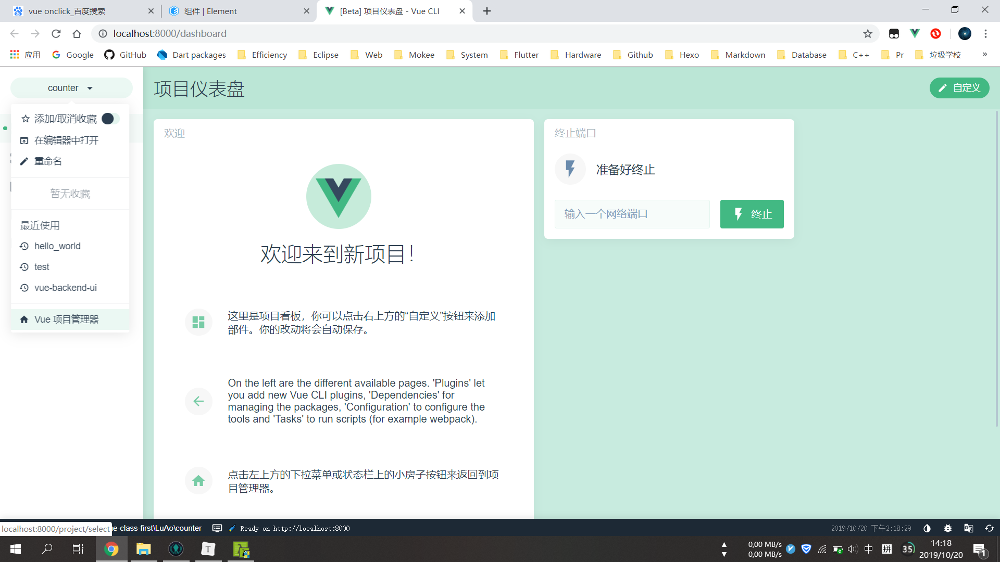
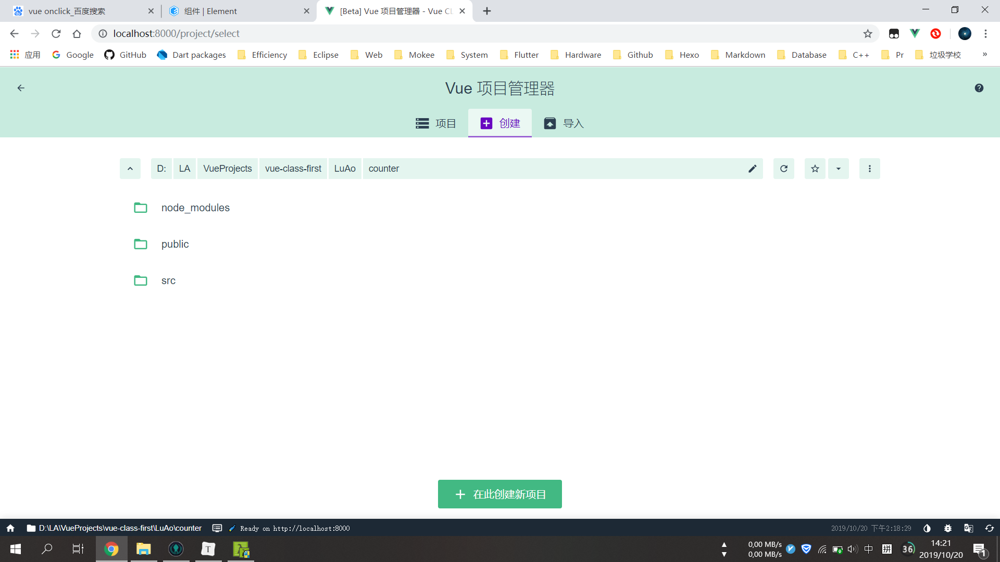
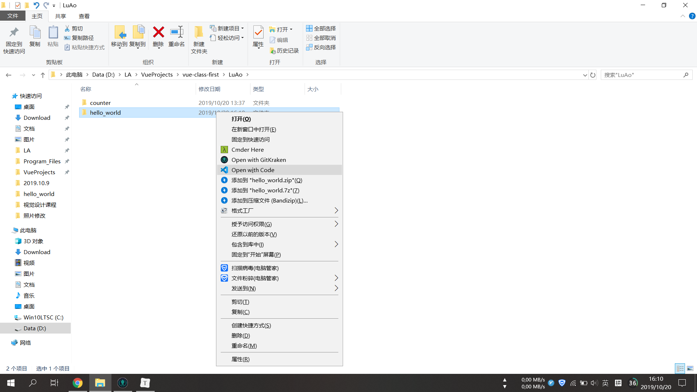
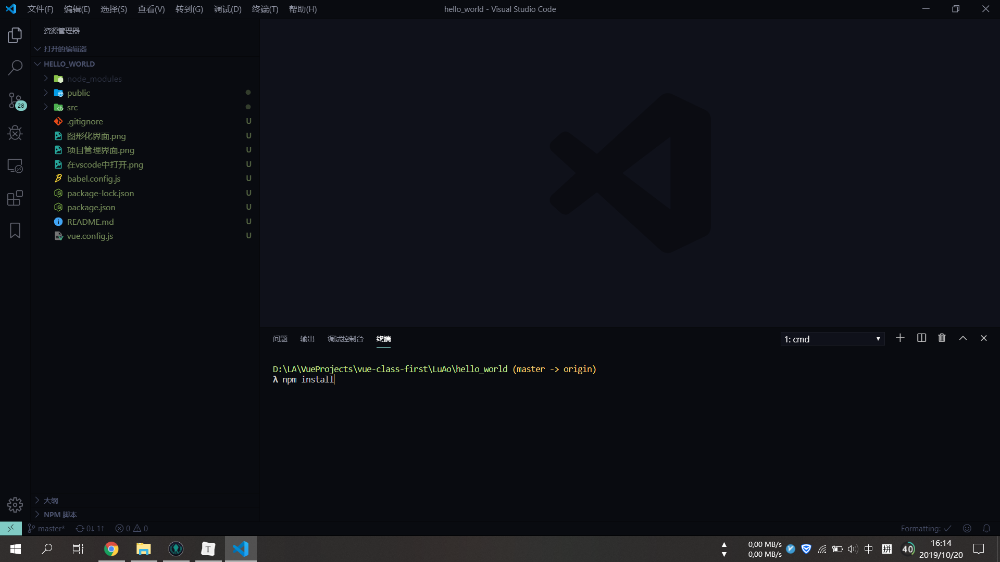

# 创建Vue CLI项目

## 启动vue图形化操作界面

打开cmd, 控制台内输入:

```javascript
vue ui
```

输入过后, vue会进行浏览器图形化界面的初始化过程, 稍等一段时间, 浏览器会自己弹出vue的图形化界面



点击项目管理器, 进入项目管理界面



在**创建**一栏内, 选择一个你偏爱的目录, 选好目录以后, 点击"在此创建新项目", 等待项目创建成功

## 初始化Vue CLI项目

项目创建完毕以后, 找到项目目录, 右键 -> Open with Code



打开vscode后, 键盘按住Ctrl+`键打开控制台, 在控制台内输入:

```javascript
npm install
```
回车, 等待任务完成



控制台内输入: 

```javascript
npm run serve
```

直至看到


好了, 在浏览器内输入: 

```http
http://localhost:8080
```

查看你的初始化项目吧